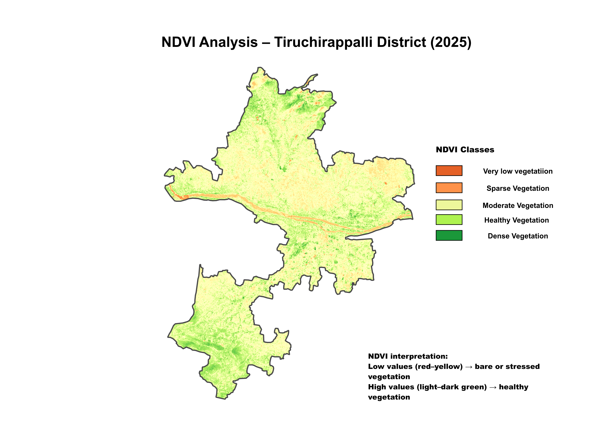
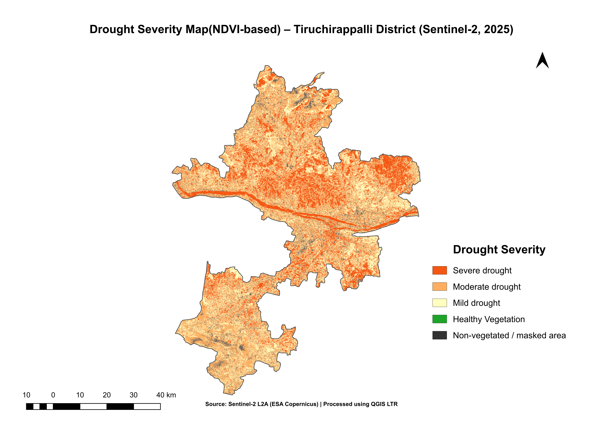

# Drought Assessment using Sentinel-2 and QGIS
Satellite-based analysis to identify vegetation stress and drought severity for agricultural monitoring using Sentinel-2 imagery.

## Overview
This project presents a satellite-based drought assessment for Tiruchirappalli District, Tamil Nadu, using Sentinel-2 surface reflectance imagery and QGIS.

The analysis focuses on vegetation health as an indicator of agricultural drought conditions.
---

## Study Area
Tiruchirappalli District, Tamil Nadu, India.

## Data Used
- Sentinel-2 MSI Level-2A (Surface Reflectance)
- Bands used: Band 4 (Red), Band 8 (NIR)

## Methodology
- Sentinel-2 imagery was clipped to the study area boundary.
- NDVI was selected as the primary indicator to represent vegetation health and infer agricultural drought conditions.
- NDVI values were reclassified into drought severity categories.
- Non-vegetated areas were masked to avoid misinterpretation.
- Final thematic maps were produced using QGIS (Long Term Release).
### Drought Severity Logic
NDVI values were reclassified into drought severity categories based on vegetation condition:
- Low NDVI values indicate stressed or sparse vegetation (severe drought)
- High NDVI values indicate healthy vegetation (no drought)

This simplified classification is suitable for regional-scale agricultural monitoring.

## Outputs
### NDVI Map

### Drought Severity Map

## 📈 Results & Interpretation

- NDVI values derived from Sentinel-2 imagery effectively captured vegetation health variations across the study area.
- Areas with low NDVI values indicate stressed or sparse vegetation, which correlates with drought-affected regions.
- The drought severity classification map highlights zones of moderate to severe vegetation stress, particularly in agricultural and fallow land areas.
- Spatial patterns observed in the results are consistent with known dry-season conditions in the Tiruchirappalli region.

## Tools
- QGIS (Long Term Release)
- Satellite Remote Sensing (Sentinel-2)

## 2025 Update
This project is an updated implementation of a Master's thesis on drought assessment.
Key workflows were re-executed in QGIS to ensure reproducibility and alignment with current GIS industry practices.

## 🎯 Skills Demonstrated

- Satellite-based drought assessment using Sentinel-2 imagery
- NDVI calculation and vegetation health analysis
- Raster preprocessing, masking, and reclassification
- Environmental analysis using remote sensing techniques
- Cartographic map production in QGIS
- Project documentation and presentation using GitHub
